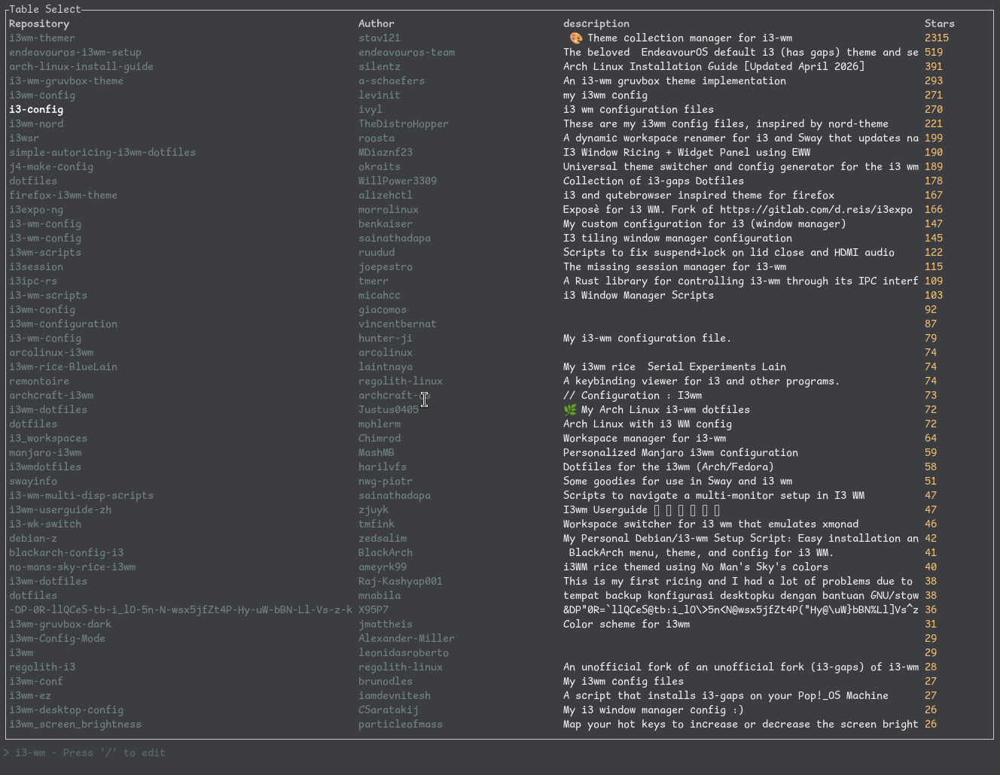

# github-terminal-explorer

Search for git repositories from your terminal.

## Current Features

+ Search for repositories
+ Check repository description, number of stars, owner

## Future Features

+ Git clone from tui
+ Preview README.md of viewed repository
+ Get information on authors
+ File Explorer for raw repository files
+ Issue Explorer

